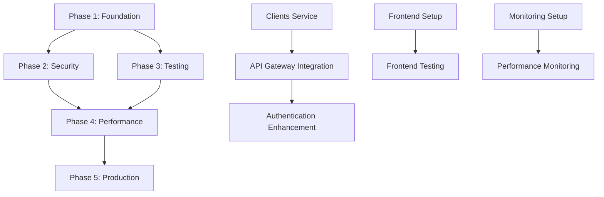

# CRM System Implementation Workflow
**Generated by**: SuperClaude /sc:workflow  
**Strategy**: Systematic  
**Date**: 2025-07-30  
**Auto-Activated Personas**: Backend, Frontend, DevOps, Security

## 📊 Current System Analysis

### ✅ **Operational Services**
- **API Gateway** (NestJS) - Port 3000 - Authentication & routing
- **Users Service** (NestJS) - Port 3001 - User management ✅ Fixed network binding
- **Notes Service** (NestJS) - Port 3003 - Note management
- **Products Service** (NestJS) - Port 3004 - Product catalog ✅ Fixed network binding, 3450 products loaded
- **PostgreSQL** - Port 5432 - Primary database
- **Redis** - Port 6379 - Caching & sessions

### 🔧 **Recent Improvements**
- ✅ Authentication system working (JWT-based)
- ✅ Network binding issues resolved
- ✅ Frontend search optimization implemented
- ✅ Docker containerization operational

### 🎯 **Identified Enhancement Areas**
1. **Missing Services**: Clients Service (commented out)
2. **Frontend Deployment**: Currently placeholder, needs production setup
3. **API Documentation**: Swagger integration incomplete
4. **Monitoring & Observability**: No centralized logging/monitoring
5. **Security Hardening**: Additional security measures needed
6. **Performance Optimization**: Database indexing, caching strategy
7. **Testing Coverage**: Automated testing framework needed

---

## 🏗️ Implementation Roadmap

### **Phase 1: Foundation Completion** (Week 1-2)
**Personas**: Backend, DevOps  
**Priority**: High  
**Estimated Time**: 40-60 hours

#### 1.1 Complete Missing Services
- [ ] **Restore Clients Service** (8 hours)
  - Uncomment and fix clients-service in docker-compose.yml
  - Fix network binding issues (apply 0.0.0.0 pattern)
  - Test CRUD operations and API endpoints
  - Verify database integration

- [ ] **API Gateway Integration** (4 hours)
  - Add clients service routes to API Gateway
  - Update environment variables
  - Test service communication

#### 1.2 Production Frontend Setup
- [ ] **Frontend Container Configuration** (6 hours)
  - Fix port mapping and environment variables
  - Optimize Dockerfile for production builds
  - Configure NGINX for production serving
  - Set up proper API URL configuration

- [ ] **Frontend Production Build** (4 hours)
  - Optimize bundle size and performance
  - Configure environment-specific builds
  - Set up proper error boundaries and logging

#### 1.3 Database Optimization
- [ ] **Performance Indexing** (6 hours)
  - Analyze query patterns in all services
  - Add appropriate database indexes
  - Optimize frequent queries (products search, user lookup)
  - Set up query performance monitoring

- [ ] **Data Integrity** (4 hours)
  - Add foreign key constraints
  - Implement soft delete patterns
  - Set up database migrations framework

### **Phase 2: Security & Monitoring** (Week 3-4)
**Personas**: Security, DevOps  
**Priority**: High  
**Estimated Time**: 50-70 hours

#### 2.1 Security Hardening
- [ ] **Authentication Enhancement** (12 hours)
  - Implement refresh token rotation
  - Add role-based access control (RBAC)
  - Set up password policies and validation
  - Implement account lockout mechanisms

- [ ] **API Security** (10 hours)
  - Add rate limiting to all endpoints
  - Implement request validation and sanitization
  - Set up CORS policies properly
  - Add security headers (helmet.js)

- [ ] **Data Protection** (8 hours)
  - Encrypt sensitive data at rest
  - Implement audit logging
  - Set up data backup encryption
  - Add GDPR compliance features

#### 2.2 Monitoring & Observability
- [ ] **Centralized Logging** (12 hours)
  - Set up ELK Stack or similar (Elasticsearch, Logstash, Kibana)
  - Configure structured logging across all services
  - Implement log aggregation and correlation
  - Set up log retention policies

- [ ] **Application Monitoring** (10 hours)
  - Implement Prometheus + Grafana or similar
  - Add custom metrics for business KPIs
  - Set up alerting for critical issues
  - Monitor database performance and connections

- [ ] **Health Checks & Circuit Breakers** (8 hours)
  - Implement health check endpoints
  - Add circuit breaker patterns for service communication
  - Set up dependency health monitoring
  - Configure automated service recovery

### **Phase 3: Testing & Quality Assurance** (Week 5-6)
**Personas**: QA, Backend, Frontend  
**Priority**: Medium  
**Estimated Time**: 40-55 hours

#### 3.1 Automated Testing Framework
- [ ] **Backend Testing** (15 hours)
  - Set up Jest testing framework for all services
  - Implement unit tests for business logic (>80% coverage)
  - Add integration tests for API endpoints
  - Set up test database and fixtures

- [ ] **Frontend Testing** (12 hours)
  - Expand React Testing Library test coverage
  - Add component integration tests
  - Implement user journey tests
  - Set up visual regression testing

- [ ] **End-to-End Testing** (10 hours)
  - Set up Playwright or Cypress
  - Create critical user journey tests
  - Add performance testing scenarios
  - Implement automated testing in CI/CD

#### 3.2 API Documentation
- [ ] **Swagger/OpenAPI Integration** (8 hours)
  - Complete Swagger setup for all services
  - Add comprehensive API documentation
  - Set up interactive API explorer
  - Generate client SDKs if needed

### **Phase 4: Performance & Scalability** (Week 7-8)
**Personas**: Performance, DevOps, Architecture  
**Priority**: Medium  
**Estimated Time**: 35-50 hours

#### 4.1 Performance Optimization
- [ ] **Database Performance** (12 hours)
  - Implement query optimization
  - Set up connection pooling
  - Add database caching strategies (Redis)
  - Optimize product search performance

- [ ] **Application Performance** (10 hours)
  - Implement response caching
  - Add compression middleware
  - Optimize asset delivery (CDN setup)
  - Performance profiling and bottleneck identification

- [ ] **Frontend Performance** (8 hours)
  - Implement code splitting and lazy loading
  - Optimize bundle size and loading times
  - Add service worker for caching
  - Implement performance monitoring

#### 4.2 Scalability Preparation
- [ ] **Microservice Communication** (8 hours)
  - Implement service mesh or API gateway patterns
  - Add load balancing configuration
  - Set up service discovery mechanisms
  - Prepare for horizontal scaling

### **Phase 5: Production Readiness** (Week 9-10)
**Personas**: DevOps, Security  
**Priority**: High  
**Estimated Time**: 30-45 hours

#### 5.1 Deployment & Infrastructure
- [ ] **CI/CD Pipeline** (12 hours)
  - Set up GitHub Actions or GitLab CI
  - Implement automated testing in pipeline
  - Configure deployment automation
  - Set up environment promotion workflow

- [ ] **Production Environment** (10 hours)
  - Configure production Docker setup
  - Set up environment variables management
  - Implement secrets management
  - Configure SSL/TLS certificates

- [ ] **Backup & Recovery** (8 hours)
  - Set up automated database backups
  - Implement disaster recovery procedures
  - Test backup restoration processes
  - Document recovery workflows

---

## 🔗 Dependency Mapping

### **Critical Path Dependencies**

### **Service Dependencies**
- **API Gateway** ← Users, Clients, Notes, Products Services
- **All Services** ← PostgreSQL Database
- **Session Management** ← Redis Cache
- **Frontend** ← API Gateway
- **Monitoring** ← All Services

### **External Dependencies**
- **Docker & Docker Compose** - Container orchestration
- **PostgreSQL 15** - Database engine
- **Redis 7** - Caching and sessions
- **Node.js 18** - Runtime environment
- **React 18** - Frontend framework

---

## ⚠️ Risk Assessment & Mitigation

### **High-Risk Areas**
1. **Database Migration Risks**
   - **Risk**: Data corruption during schema changes
   - **Mitigation**: Backup before migrations, staged rollout, rollback procedures

2. **Service Downtime**
   - **Risk**: Authentication service failures affecting all users
   - **Mitigation**: Health checks, circuit breakers, graceful degradation

3. **Performance Degradation**
   - **Risk**: Poor performance with large product catalog
   - **Mitigation**: Database indexing, query optimization, caching strategies

### **Medium-Risk Areas**
1. **Security Vulnerabilities**
   - **Risk**: Inadequate input validation leading to attacks
   - **Mitigation**: Security testing, code reviews, penetration testing

2. **Frontend Deployment Issues**
   - **Risk**: Environment-specific configuration problems
   - **Mitigation**: Containerized deployment, environment parity

---

## 🔄 Parallel Work Streams

### **Stream A: Backend Services** (Backend Persona)
- Clients Service restoration
- API Gateway enhancements
- Database optimizations
- Security implementations

### **Stream B: Frontend Development** (Frontend Persona)
- Production deployment setup
- Performance optimizations
- Testing framework expansion
- UI/UX improvements

### **Stream C: Infrastructure & DevOps** (DevOps Persona)
- Monitoring and logging setup
- CI/CD pipeline implementation
- Production environment configuration
- Backup and recovery systems

### **Stream D: Quality Assurance** (QA Persona)
- Test automation framework
- API documentation
- Performance testing
- Security testing

---

## 📋 Immediate Next Steps (Session Tasks)

### **Priority 1: Critical Issues**
1. **Restore Clients Service** - Currently missing, blocks client management features
2. **Fix Frontend Deployment** - Currently placeholder, needs production setup
3. **Complete API Gateway Routing** - Missing clients service integration

### **Priority 2: Quick Wins**
1. **Add Health Check Endpoints** - Improve monitoring capabilities
2. **Implement Request Logging** - Better debugging and analytics
3. **Add API Rate Limiting** - Basic security improvement

### **Priority 3: Foundation Building**
1. **Set up Testing Framework** - Enable quality assurance
2. **Configure Production Builds** - Prepare for deployment
3. **Database Index Optimization** - Improve query performance

---

## 📈 Success Metrics

### **Phase 1 Success Criteria**
- [ ] All services operational and accessible
- [ ] Frontend deployed and functional
- [ ] Database performance benchmarks established
- [ ] Basic security measures implemented

### **Phase 2 Success Criteria**
- [ ] Security audit passed (no critical vulnerabilities)
- [ ] Monitoring dashboards operational
- [ ] Incident response procedures documented
- [ ] Performance baselines established

### **Phase 3 Success Criteria**
- [ ] >80% test coverage achieved
- [ ] API documentation complete and accurate
- [ ] Automated testing pipeline operational
- [ ] Quality gates enforced in CI/CD

### **Phase 4 Success Criteria**
- [ ] Performance targets met (sub-200ms API responses)
- [ ] System handles expected load (1000+ concurrent users)
- [ ] Scalability patterns implemented
- [ ] Performance monitoring operational

### **Phase 5 Success Criteria**
- [ ] Production deployment successful
- [ ] Zero-downtime deployment capability
- [ ] Disaster recovery tested and documented
- [ ] Production monitoring fully operational

---

## 🛠️ Implementation Commands Integration

This workflow integrates seamlessly with other SuperClaude commands:

- **`/sc:implement`** - Execute specific features from this workflow
- **`/sc:analyze`** - Assess current codebase before implementing changes
- **`/sc:task`** - Create persistent tasks for long-term workflow tracking
- **`/sc:spawn`** - Coordinate parallel work streams across multiple sessions

---

**Generated by SuperClaude /sc:workflow** 🚀  
**Framework**: Systematic implementation strategy with expert persona guidance  
**MCP Integration**: Context7 (patterns), Sequential (analysis), Magic (UI components)